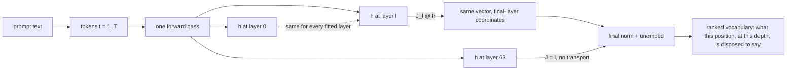
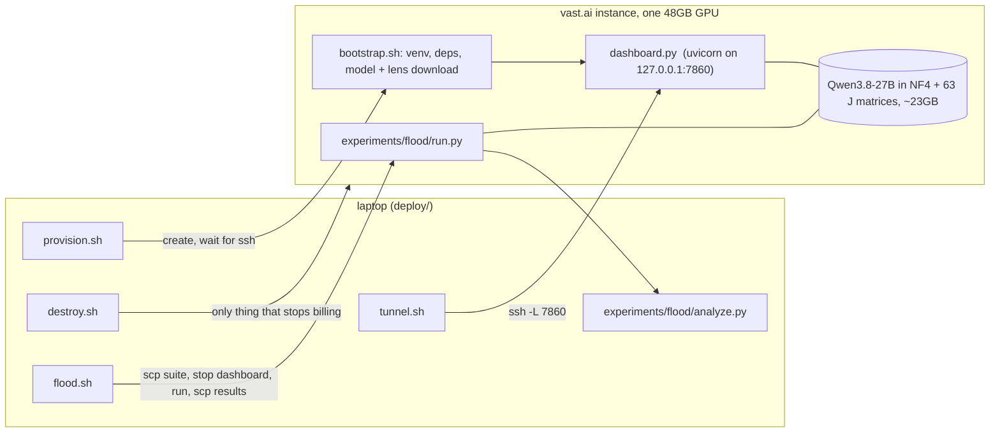
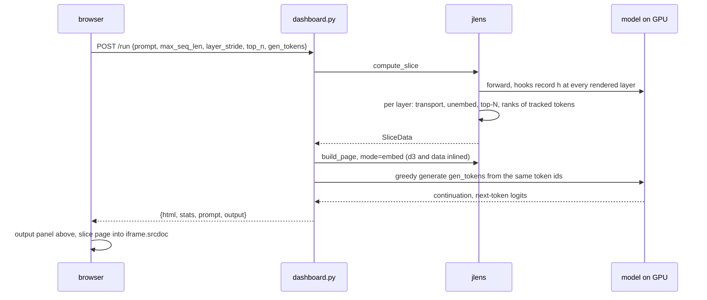
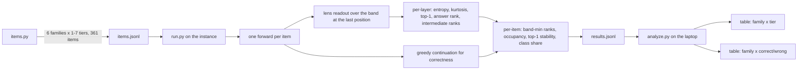
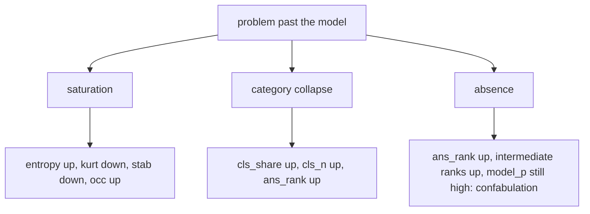

# J-lens tooling: how it works and how to read it

This covers the three pieces in this fork that sit on top of the reference
implementation: the dashboard (`deploy/`), its model-output panel, and the
capacity-flood suite (`experiments/flood/`). The fitting brief in the Staxis root
covers the lens itself in depth; the paper is Gurnee et al. 2026, arXiv 2607.15495.

## 1. What the lens computes

A transformer holds one residual vector per token per layer. Only the final layer has
a dictionary to words: the unembedding. The Jacobian lens gives every earlier layer
that dictionary by transporting its residual into the final layer's coordinates with a
fixed matrix `J_l`, the model's own input-output Jacobian averaged over a corpus.

Two consequences shape everything below:

- The readout at position `t` is about the next token, not about token `t`. The cell
  under `boot` in "the country shaped like a boot is" says what the model is inclined
  to emit after `boot`. The interesting readouts are one column left of where you
  first look.
- Layer 63 has no `J` in the lens. Its row is the model's real next-token output. It
  is the ground truth every other row is compared against.

## 2. Where things run

The dashboard and the suite cannot run at the same time: each holds the model, and
two copies do not fit the card. `flood.sh` stops the dashboard, runs the suite, and
restarts the dashboard with the idempotent bootstrap.

## 3. One dashboard request

The generation runs from the exact token ids the slice used, so the continuation
follows precisely the prompt the grid shows. Everything is serialised behind one lock
because jlens registers hooks on the shared blocks.

## 4. The visualisations

### 4.1 The slice grid

The main panel is a heatmap: columns are prompt positions, rows are layers, shallow at
the top. Each cell shows the lens top-1 word at that position and depth, with a
superscript giving that word's rank over the full vocabulary. Ranks are computed over
all 250k tokens even when the display is masked to word-like tokens, so a `1` means
that word would be emitted if the model decoded from that layer.

An illustrative grid for the boot prompt, rows thinned, with the columns that matter:

| layer | `country` | `shaped` | `like` | `a` | `boot` | `is` |
|---|---|---|---|---|---|---|
| 8 | that¹ | like¹ | a¹ | boot¹ | ,¹ | the¹ |
| 24 | of² | like¹ | a¹ | shoe³ | **Italy**¹ | the¹ |
| 36 | of¹ | in² | a¹ | boot¹ | **Italy**¹ | called² |
| 48 | of¹ | like¹ | the² | boot¹ | **Italian**² | the¹ |
| 56 | of¹ | like¹ | a¹ | boot¹ | Italy³ | **euro**¹ |
| 63 | of¹ | like¹ | a¹ | boot¹ | ,¹ | **euro**¹ |

Read it column by column. Under `boot`, mid layers name the bridge entity `Italy`,
which is in the prompt nowhere, and the bottom row does not say it: the model worked
it out and did not say it. Under `is`, the answer `euro` forms late and the bottom row
confirms it. Early rows mostly echo the current token or a bigram; the last few rows
converge on layer 63. On this model the band the paper calls the workspace maps to
roughly layers 24 to 58. The grid is illustrative; real ranks will differ.

Depth bands, mapped from the paper's 0 to 100 reindex onto 64 layers:

| band | layers | what the lens shows |
|---|---|---|
| sensory | 0 to 23 | mostly noise, current token, bigrams; J is near-orthogonal to the logit lens |
| workspace | 24 to 58 | persistent abstract content distinct from input and output; intermediates live here |
| motor | 59 to 63 | converges on the output; the logit lens works here too |

Controls, all in the page's `?` tooltip:

- Click a cell to select a position and layer. The two side panels update: **By Layer**
  lists the top-N tokens at every rendered layer for the selected position, **By Pos**
  lists the top-N at every position for the selected layer.
- Click a token in either panel to pin it. Pinned tokens get a colour, are highlighted
  wherever they appear in the grid, and get a rank-versus-layer line in the By Layer
  chart and a rank-versus-position line in the By Pos chart.
- Click a pin chip to put that token on the **rank heatmap**: the same position-by-layer
  grid painted with the pinned token's log rank in viridis, dark is rank 1. This is the
  single most useful view for "where does this concept live".
- Shift and hover scrubs, arrow keys move the selection, the whitespace box lets
  space and newline tokens compete for cells.

What counts as signal: a rank in the single digits, stable across several adjacent
layers, at a position where it makes sense. A word at rank 1 in one cell and nowhere
else is noise, and with 250k tokens noise is common. A pinned token that is rank 1 at
layer 30 and rank 40,000 at layer 63 is the signature of "computed, then not said". A
token whose rank falls monotonically to 1 by layer 63 is just the answer forming.

### 4.2 The output panel

Above the iframe. The prompt in grey, then the greedy continuation of `gen_tokens`
tokens highlighted, special tokens left visible. Below it, the top `top_n` next-token
candidates at the last prompt position with probabilities.

The panel and the L63 row show the same distribution, differently. L63 shows its top-1,
masked to word-like tokens. The panel is unmasked and has probabilities, so it tells a
confident answer from a coin flip, and it shows when a punctuation or space token
actually wins. If the panel says `euro 71%` and the L63 cell says `euro¹`, they agree.
If the panel says `the 34%, a 22%` and the grid has an intermediate at rank 1 in the
band, the model knows something it is not committing to.

### 4.3 The quantization check

The lens was fitted on the bf16 model; the instance serves NF4. If L63 looks sane and
the rows just above it do not, suspect that drift before the model. If L63 is also
garbage, the prompt or tokenization is wrong. Prefer claims about ordering across
layers to claims about any single rank.

## 5. The flood suite

The suite asks what the workspace looks like when a problem is past the model. The
paper stops short of this: it shows the band holds a category rather than many items
(list task, §4.2), that an arithmetic task and a concept are token-exclusive with the
computation paying the cost (§A.17), and that swap failures are where a concept was
weakly loaded (§3.4). Nobody walks difficulty past the model and reports the far side.

Families and what rises with tier:

| family | tiers | difficulty axis |
|---|---|---|
| arith | 1 to 7 | 1 to 4 are the paper's modulation tiers; 5 to 7 need a 2, 3 or 4 digit product held covertly, reduced mod a small number so the answer stays one token |
| count-letter | 1 to 4 | word length; two items a word, the most frequent letter and the rarest one still present |
| nth-letter | 1 to 4 | word length and index depth |
| anagram | 1 to 5 | word length |
| multihop | 1 to 4 | number of bridge entities, each labelled as an intermediate |
| trick | 1 | nothing; a single tier of questions whose wrong answer is the available one, as a clean test of failure with the right answer in hand |

Per-item metrics, all at the readout position over the band:

| column | definition | direction |
|---|---|---|
| `acc` | greedy continuation starts with an answer form | falls with tier by construction |
| `ans_rank` | best rank of any answer form over the band, median | rises when the answer never loads |
| `ans_rank2` | the same, best over the last two positions | the one to read: the answer lands on the `=` or the `is`, not on the final token |
| `knew` | fraction of band-scored items with `ans_rank2` at 3 or better | the answer was available, whatever came out |
| `conf_wrong` | fraction of the group's wrong items whose output top-1 probability is at least 0.5 | confidently wrong: the failures a router cannot see from the output |
| `knew_cw` | of those, the fraction with `ans_rank2` at 3 or better | splits the confident failures: high is answer-in-hand, low is absence |
| `model_p` | probability of the answer at layer 63 | confidence of the actual output |
| `entropy` | minimum over band layers of the lens distribution's entropy | high means no candidate dominates |
| `kurt` | maximum over band layers of excess kurtosis of the lens logits | the paper's "nonrandomness"; low is diffuse. Still in `results.jsonl`, dropped from the analyzer table: it moved with neither tier nor outcome in run 2 |
| `occ` | distinct tokens in the word-like top-10 across the band | how many candidates compete |
| `stab` | fraction of adjacent band layers with the same top-1 | low means the readout thrashes with depth |
| `cls_share` | fraction of top-10 tokens that are the answer's type class, digits or letters | high with high `ans_rank` means the band holds the type, not the value |
| `cls_n` | distinct class members seen in the band | many digits at once is the list-task flood on a problem |

### 5.1 The three candidate signatures

"Capacity flood" has no definition in the literature. The suite records enough to test
three readings, and the second analyzer table, correct versus wrong within a family,
is where one of them either tracks correctness or does not.

Run 2 separated the families rather than picking one signature. Arithmetic past tier 5
is **absence**: the answer is nowhere in the band, the covert product's first digit is
only weakly loaded, occupancy rises and top-1 stability falls, and the output is still
confident. count-letter and roughly half of multihop are the opposite, a case the three
readings did not anticipate: the correct answer sits at band rank 0 or 1 at the position
before the last, and the model emits a different value anyway. Neither saturation nor
category collapse tracked correctness on its own. The readout position matters as much
as the signature: the answer is computed at the `=` or the `is` and read there as a
number word, while the final token's band holds the task, which is why `ans_rank2`
replaced `ans_rank` as the column to read.

That is two failure modes, not one, and they want opposite responses. Absence means the
value was never computed, so the only fix is decomposition: break the problem up and
spend more forward passes on the pieces. Answer-in-hand means the value was computed and
the output stage lost it, so the fix is cheap: re-read the band, or re-sample. Output
probability cannot tell them apart, since both are confidently wrong, which is the whole
case for a band read in the router: `conf_wrong` finds the failures the output hides and
`knew_cw` says which of the two responses is the right one. A router that cannot make
that split pays decomposition cost on problems that needed a second look, which is the
difference between a gating signal that saves tokens and one that spends them.

How to read the tables:

- Within a family, walk the tier rows. `acc` should fall. Watch which of `entropy`,
  `occ`, `stab`, `cls_share`, `ans_rank` moves with it and at which tier. A metric
  that moves before `acc` falls is a leading indicator, which is what a gating signal
  needs.
- In the correctness table, compare `correct` against `wrong` for the same family. A
  column that separates them is a per-item detector. A column that only separates
  tiers, not outcomes, is measuring difficulty of the prompt, not failure of the model.
- `model_p` high on wrong items is the confabulation case: the output layers are
  confident and the band never had the answer. That is the absence signature and the
  most dangerous one for routing, because nothing at the output flags it.
- Flat curves everywhere mean the band is wrong before they mean the effect is
  absent. Sweep it with `flood.sh -- --band 20 60`.

Everything here is measured through a bf16-fitted lens on NF4 weights. Compare tiers
within a family, not absolute values across families or against the paper.
